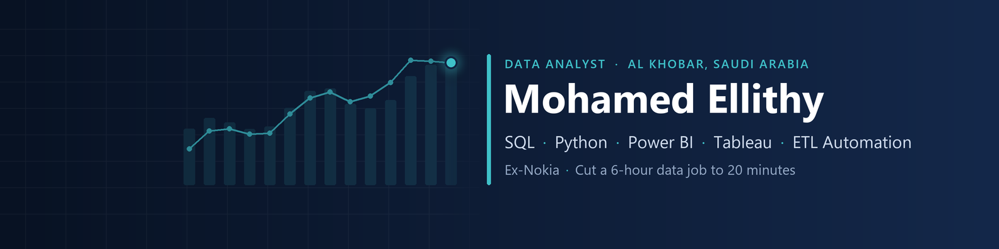

At Nokia (Sep 2023 to Jan 2026) I automated telecom KPI reporting with Python and SQL. Manual reporting dropped by 85%, a 6-hour XML processing job now runs in 20 minutes, and about 98% of manual data entry was removed. I'm also studying for an MSc in Data Science at the University of East London.

**Open to Data Analyst and BI roles** in Khobar, Dammam, Riyadh and Jeddah. Transferable Iqama, available now.

Contact: [LinkedIn](https://www.linkedin.com/in/mohamed-el-lithy/)

## Projects

| Project | What it shows | Tools |
|---|---|---|
| **[Riyadh 4G Network Intelligence](https://github.com/mellithyy/riyadh-4g-network-intelligence)** [Live dashboard](https://mellithyy.github.io/riyadh-4g-network-intelligence/) | Benchmarked 3 LTE operators on 2.7M crowdsourced measurements. Found 4 data-quality defects (27.5% of rows) that would have flipped the operator ranking. 24-hour traffic forecasts where SARIMA beat 4 baselines (MASE 0.76). | Python statsmodels Tableau |
| **[Saudi Consumer Spending Intelligence](https://github.com/mellithyy/saudi-consumer-spending-intelligence)** In progress | Weekly card spending by city and sector from SAMA point-of-sale data (270 weeks, 31,262 rows). Stage 1 of 7 done: API extraction with checks. Next: cleaning, SQL warehouse, Power BI dashboard and forecast. | Python pandas SQL Power BI |
| **[SQL Server Data Warehouse](https://github.com/mellithyy/sql-data-warehouse-with-eda-project)** Course project | Bronze, silver and gold layers, T-SQL ETL and a star schema over ERP and CRM data, with SQL analysis of customers, products and sales. | SQL Server T&#8209;SQL |
| **[Heart Disease Risk Model](https://github.com/mellithyy/heart-disease-risk-model)** [Live app](https://heart-disease-risk-mellithyy.streamlit.app) | 15 yearly CDC surveys (6.7M adults) harmonised into one dataset. Audited my 2022 model (a data leak turned F1 0.29 into 0.91) and rebuilt it with a 2025 hold-out test: ROC-AUC 0.85, calibrated. Streamlit app. | Python pandas scikit&#8209;learn Streamlit |

## Tools

| Area | Tools |
|---|---|
| Analysis | SQL, Python (pandas, NumPy), statistics, forecasting (SARIMA, Prophet) |
| BI and reporting | Power BI (DAX, Power Query), Tableau, Excel |
| Data engineering | ETL pipelines, data-quality checks, SQL Server, star schema |
| Workflow | Git, GitHub, Jupyter, VS Code |

**Earlier coursework (2021 to 2022):** [US Bike Share Analysis](https://github.com/mellithyy/Explore-US-Bikeshare-Data) · [Automatic Review Analyzer](https://github.com/mellithyy/Automatic-Review-Analyzer) · [MNIST Digit Recognition](https://github.com/mellithyy/MNIST_Digit_Recognition_with_Non-Linear_Classification)
